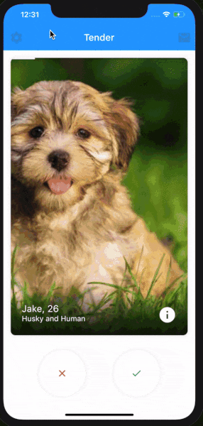
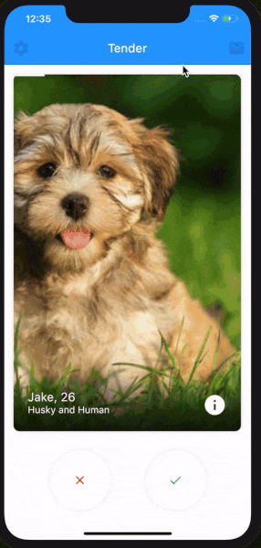

# Healthy Ageing

Connecting dog-lovers and dog-owners to enable the healthy ageing amongst
the older generation in Ireland.


## Getting Started

### Prerequisites

You will need to have installed:
```
Flutter
```

Make sure flutter is downloaded and passed all the requirements.

```
$ flutter doctor
```

### Installation
Clone the repository:
```
$ git clone https://github.com/ahmedhamedaly/Healthy-Ageing.git
$ cd Healthy-Ageing
```

Download all required packages using:
```
$ flutter packages get
```

Connect your device and run the project (while you're in the directory).
```
$ flutter run
```

## Prototype

### Discover Dog Owners Around You


### View and Customise Your Profile



### Chat with Dog Owners You Have Matched With




### Authors
* [Ahmed Hamed Aly](https://github.com/ahmedhamedaly)
* [Alannah Henry](https://github.com/alannahhenry)
* [Emily Harte](https://github.com/emilyharte)
* [Jack Keenan](https://github.com/jakeenan2020)
* [Maghnus Hartigan](https://github.com/Mushman2)
* [Ruijie Xiong](https://github.com/Jane616)
* [Sanil Gupta](https://github.com/guptasanil)
